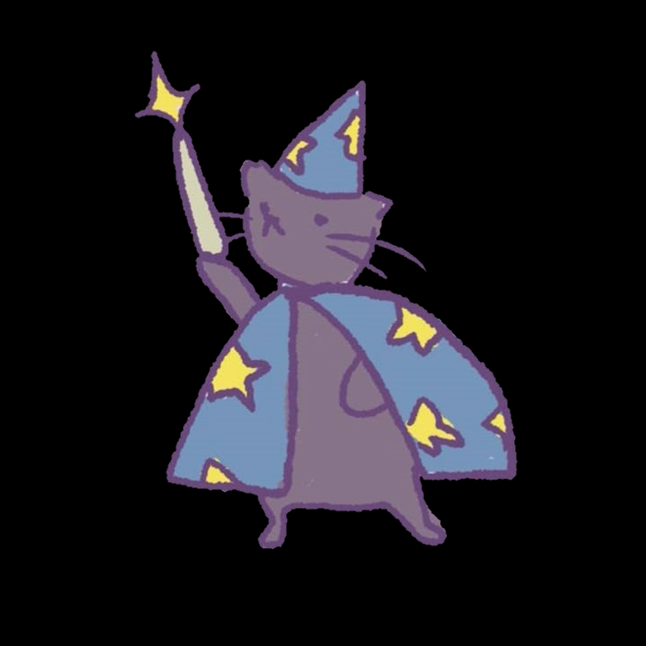

# **Artifacts**

+ 8/2/2026 - 2026 [Git & GitHub Crash Course for Beginners](https://youtu.be/mAFoROnOfHs?si=BBSlgDeLO12524l3)
+ create git-journey repositoy and first commit one.txt
+ create README file to document artifacts
+ dir to staging area to repo
+ reset, remove
+ branch, merge, commit, version control
+ push pull fetch merge local to remote
+ Markdown Language, git bash, git, github
